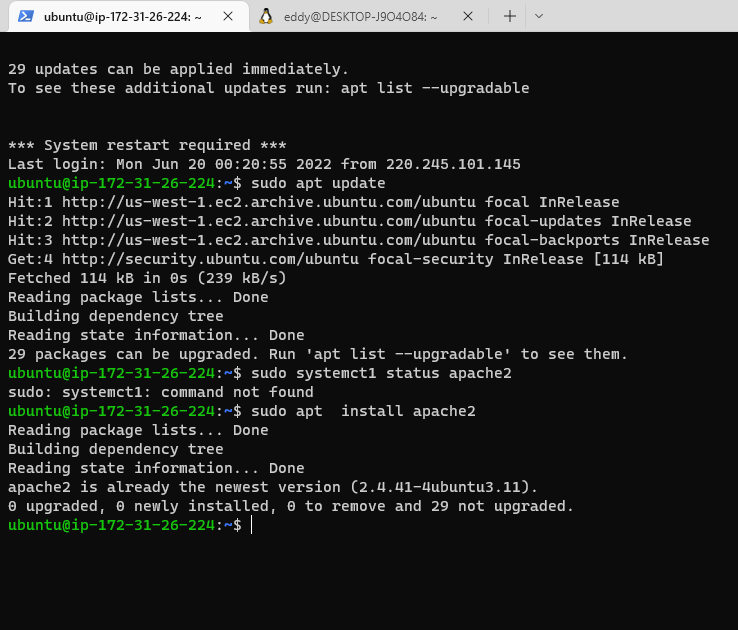

# Project-1
## Step 1
Documentation For project 1
* sudo app install apache2  
* sudo systemtl apache2
  

* 
To verify that apache2 is running as a Service 

* 
After allowing inbound rules for port 80 and checking this on the web browser 

_
 End of Steps 1 
_

## Step 2