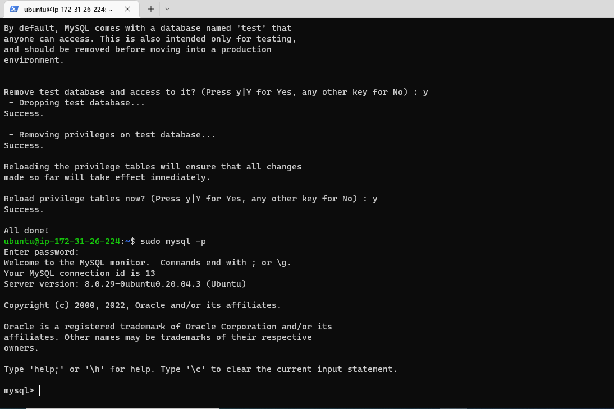

# Project-1
## Step 1
Documentation For project 1
1. Installing Apache2
* sudo app install apache2  
* sudo systemtl apache2
  

* 
To verify that apache2 is running as a Service 

* 
After allowing inbound rules for port 80 and checking this on the web browser 

_
 End of Steps 1 
_

## Step 2
1. 
Installing my SQL

## Step 3
3.  
Installing my PHP

## STEP 4 
4. 
Creating a virtual host for a website using Apache

* Create a new blank file on apache

* Steps down to the final stage to reload Apache for the changes to take place.
  

  *Website view on Public IP and Public DNS.
  
   
  

  *Final PHP page and code
  
  